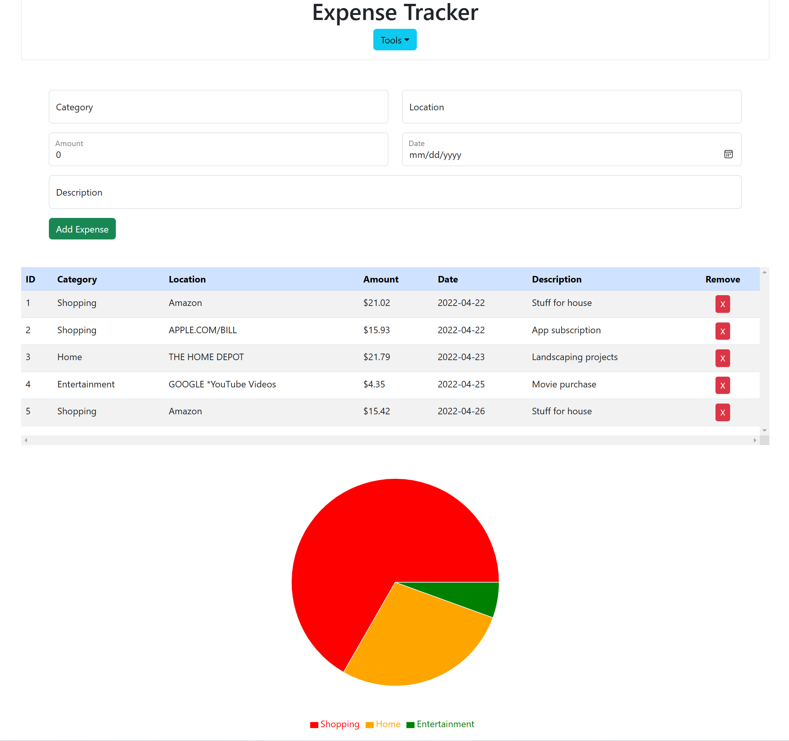

# React Expense Tracker

_An expense tracker written with React, Bootstrap, JavaScript, and HTML_

Use it [here](https://gks-expense-tracker.azurewebsites.net/)

## Summary

A simple expense tracking app that allows you to add expenses, tracking the category of the expense, the location, amount, date, and a description.

A pie chart shows the breakdown of your expenses by percentage.

This expense tracker was written with React v18 using only functional components. It was styled with Bootstrap v5.

## Author

- **Graham Smith** - Full-Stack Software Developer - [GrahamS.tech](https://www.grahams.tech)
